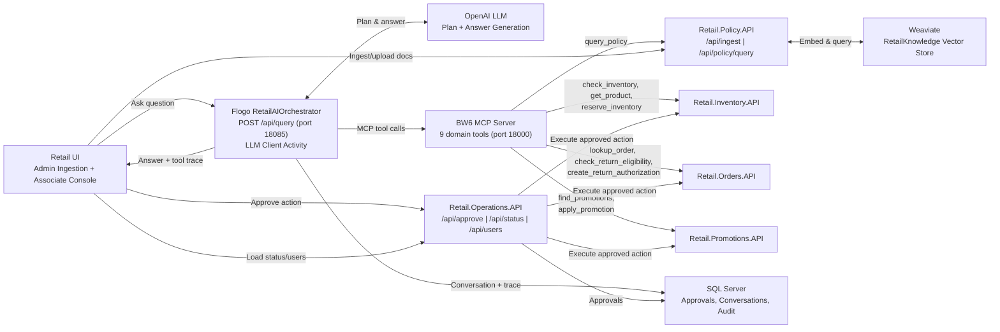

# Retail Agentic AI - BW & Flogo: Better Together

A retail agentic AI demo showcasing **TIBCO BusinessWorks 6** and **TIBCO Flogo** working together. A store associate asks natural-language questions through a web UI; the **Flogo RetailAIOrchestrator** receives the query and uses its **LLM Client Activity** to plan which tools to call, executes them against the **BW6 MCP Server** (which fronts all BW6 domain APIs), and generates the final answer — all in a single activity. The BW6 apps provide the domain microservices (inventory, orders, promotions, policy, operations) and the MCP Server that exposes them as tools.

## How It Works

```text
UI (Associate Console)
  -> Flogo RetailAIOrchestrator  POST /api/query  (port 18085)
       -> LLM Client Activity (PlanAndExecute)
            -> LLM plans which tools to call (OpenAI)
            -> Calls tools via BW6 MCP Server (port 18000)
                 -> Retail.Inventory.API
                 -> Retail.Orders.API
                 -> Retail.Promotions.API
                 -> Retail.Policy.API (RAG via Weaviate)
            -> LLM generates final answer from tool results
       -> ReturnResponse (HTTP 200 JSON)
  -> UI displays answer with citations / tool trace / approval buttons
```

The Flogo orchestrator replaces ~1,330 lines of custom BW6 Java code (`RetailLLMPlanner.java`, `RetailLLMAnswerGenerator.java`, `RetailAgentPlanner.java`, `McpStdioClient.java`, `McpToolGateway.java`) with a **single LLM Client Activity** connected to the BW6 MCP Server. This is the "Better Together" story: Flogo handles AI orchestration while BW6 provides  domain APIs .

### Flogo Flow

The Flogo app has a simple 3-step flow:

```
ReceiveHTTPMessage (POST /api/query, port 18085)
    -> PlanAndExecute (LLM Client Activity — connected to BW6 MCP Server)
    -> ReturnResponse (HTTP 200 with answer JSON)
```

The **PlanAndExecute** activity:
1. Takes the customer question, customer ID, and store ID as input
2. Sends them to the LLM with a system prompt and the list of 9 available MCP tools
3. The LLM plans which tools to call (e.g., `check_inventory`, `get_product`, `query_policy`)
4. Executes the planned tool calls against the BW6 MCP Server via MCP protocol (HTTP Streamable)
5. The LLM synthesizes the tool results into a natural-language answer
6. Returns the response to the caller

### Architecture Diagram



## Project Structure

```
Retail_AI_BW_Flogo/
├── RetailAIOrchestrator.flogo          # Flogo AI orchestrator (port 18085) — the "brain"
├── RetailBW6-UI/                       # Static web UI
│   ├── index.html                      #   Main page (Admin Ingestion + Associate Console)
│   ├── app.js                          #   Application logic and API calls
│   └── styles.css                      #   Styling
└── BW_Apps/                            # BW6 domain microservices — the "muscles"
    ├── Retail.Inventory.API            #   Products, availability, reservations
    ├── Retail.Orders.API               #   Orders, returns
    ├── Retail.Promotions.API           #   Promotions, applications
    ├── Retail.Policy.API               #   Ingest, upload, policy RAG query (port 18083)
    ├── Retail.Operations.API           #   Users, approvals, conversations (port 18084)
    ├── Retail.MCP.Gateway.API          #   REST wrapper for MCP tools (port 18086)
    ├── Retail.Shared                   #   Shared resources
    └── *.application                   #   BW6 application descriptors
```

## Components

| Component | Default URL / Port | Runtime | Purpose |
|---|---|---|---|
| Retail BW6 UI | `http://localhost:3001` | Static HTML/JS | Demo UI (Admin Ingestion + Associate Console) |
| **RetailAIOrchestrator** | `http://localhost:18085` | **Flogo** | AI orchestrator — receives queries, plans via LLM, calls BW6 MCP tools |
| BW6 MCP Server | `http://localhost:18000/rest/mcp` | BW6 | Exposes 9 domain tools via MCP protocol |
| Retail.Operations.API | `http://localhost:18084` | BW6 | Users, status, approvals, conversations |
| Retail.Policy.API | `http://localhost:18083` | BW6 | Ingest, upload, policy RAG query |
| Retail.MCP.Gateway.API | `http://localhost:18086` | BW6 | REST wrapper for MCP tools |
| Retail.Inventory.API | _(internal)_ | BW6 | Products, availability, reservations |
| Retail.Orders.API | _(internal)_ | BW6 | Orders, return eligibility, return auth |
| Retail.Promotions.API | _(internal)_ | BW6 | Promotions, applications |
| Weaviate | `http://localhost:8080` | Docker | Vector store for policy RAG |
| SQL Server | `localhost:14333` | Docker | Operations and audit store |

## Prerequisites

| Prerequisite | Version / Details |
|---|---|
| **TIBCO Flogo** | **2.26.4** or later |
| **TIBCO BusinessWorks 6** | **6.12.0 HF3** or later, with the **AI Plugin**, **JDBC**, **REST/JSON**, and **Java** palettes |
| **Node.js** | Required by the BW6 MCP Gateway — it uses `npx mcp-remote` to bridge STDIO MCP to the BW6 MCP Server |
| **Java** | JDK 17+  |
| **Docker** | For SQL Server and Weaviate containers |
| **OpenAI API key** | Used by both the Flogo orchestrator and BW6 Java classes for LLM calls |
| **Python 3** | (or any static file server) to serve the UI |

## Setup

### 1. Configure the Flogo App (RetailAIOrchestrator)

Before running the Flogo orchestrator, update the **app properties** in `RetailAIOrchestrator.flogo`:

| App Property | Default Value | What to Change |
|---|---|---|
| `LLMClient.API_Key` | `YOUR_OPENAI_API_KEY` | **Required** — replace with your own OpenAI API key |
| `LLMClient.LLM_Provider` | `OpenAI` | Change if using a different provider (Anthropic, Gemini, Ollama, etc.) |
| `LLMClient.LLM_Model` | `gpt-5.6` | Change to your preferred model (e.g., `gpt-4.1-mini`, `gpt-4.1`) |
| `MCP_Server_URL` | `http://localhost:18000/rest/mcp` | Update if the BW6 MCP Server runs on a different host/port |
| `RetailAgent.SystemPrompt` | _(pre-configured)_ | No change needed — defines the AI assistant's behavior and tool usage rules |

You can edit these properties in the Flogo Enterprise UI (VS Code extension or Web UI) or directly in the `.flogo` JSON file.

### 2. Configure the BW6 Apps

The BW6 domain APIs require:

- **OpenAI API key** — set as an environment variable before starting BW6 processes:
  ```bash
  export OPENAI_API_KEY="your_openai_api_key"
  ```
  The BW6 Java classes (`RetailLLMPlanner.java`, `RetailLLMAnswerGenerator.java`) read this from the environment. You can also configure it in TIBCO BusinessStudio. Do not hardcode the key in Java source.

- **SQL Server JDBC connection** — the BW6 apps connect using:
  ```
  jdbc:sqlserver://localhost:14333;databaseName=RetailBW6Ops;encrypt=true;trustServerCertificate=true
  ```
  Update the JDBC shared resource in BusinessStudio if your SQL Server runs on a different host/port.

- **Weaviate URL** — the Policy API connects to Weaviate at `http://localhost:8080` for vector storage. Update if running elsewhere.

- **Node.js** — the MCP Gateway uses `npx mcp-remote` to bridge to the BW6 MCP Server. Ensure Node.js is installed and `npx` is on your PATH.

### 3. SQL Server

> **Note:** The passwords below (`bw6retail@123`, `bw6retail@456`) are example values for a
> local Docker instance only. Change them to your own secrets before any non-local use.

```bash
docker run -d \
  --network ai-demo-network \
  --platform linux/amd64 \
  --name retail-bw6-sqlserver \
  -e "ACCEPT_EULA=Y" \
  -e "MSSQL_PID=Developer" \
  -e "MSSQL_SA_PASSWORD=bw6retail@123" \
  -p 14333:1433 \
  -v retail-bw6-sqlserver-data:/var/opt/mssql \
  mcr.microsoft.com/mssql/server:2022-latest
```

Create the database and user:

```bash
docker exec -it retail-bw6-sqlserver /opt/mssql-tools18/bin/sqlcmd \
  -S localhost -U sa -P 'bw6retail@123' -C
```

```sql
CREATE DATABASE RetailBW6Ops;
GO
USE RetailBW6Ops;
GO
CREATE LOGIN retail_bw6_ops_user WITH PASSWORD = 'bw6retail@456';
GO
CREATE USER retail_bw6_ops_user FOR LOGIN retail_bw6_ops_user;
GO
ALTER ROLE db_owner ADD MEMBER retail_bw6_ops_user;
GO
```

Then create the required tables:

```sql
USE RetailBW6Ops;
GO

-- Approvals
CREATE TABLE retail_approvals (
  approval_id uniqueidentifier NOT NULL DEFAULT NEWID() PRIMARY KEY,
  tool_name nvarchar(120) NOT NULL,
  arguments_json nvarchar(max) NOT NULL,
  summary nvarchar(max) NOT NULL,
  status nvarchar(20) NOT NULL DEFAULT 'pending',
  created_at datetimeoffset NOT NULL DEFAULT SYSDATETIMEOFFSET(),
  completed_at datetimeoffset NULL,
  approved_by_json nvarchar(max) NULL,
  result_json nvarchar(max) NULL,
  CONSTRAINT ck_retail_approvals_status CHECK (status IN ('pending','approved','rejected')),
  CONSTRAINT ck_retail_approvals_arguments_json CHECK (ISJSON(arguments_json) = 1),
  CONSTRAINT ck_retail_approvals_approved_by_json CHECK (approved_by_json IS NULL OR ISJSON(approved_by_json) = 1),
  CONSTRAINT ck_retail_approvals_result_json CHECK (result_json IS NULL OR ISJSON(result_json) = 1)
);
CREATE INDEX retail_approvals_status_created_idx ON retail_approvals (status, created_at DESC);

-- Reservations
CREATE TABLE retail_reservations (
  reservation_id nvarchar(80) NOT NULL PRIMARY KEY,
  approval_id uniqueidentifier NULL REFERENCES retail_approvals(approval_id),
  sku nvarchar(80) NOT NULL,
  product_name nvarchar(240) NULL,
  store_id nvarchar(80) NOT NULL,
  customer_id nvarchar(80) NOT NULL,
  quantity_reserved int NOT NULL DEFAULT 1,
  expires_in_minutes int NOT NULL DEFAULT 90,
  created_at datetimeoffset NOT NULL DEFAULT SYSDATETIMEOFFSET()
);
CREATE INDEX retail_reservations_created_idx ON retail_reservations (created_at DESC);

-- Return Authorizations
CREATE TABLE retail_return_authorizations (
  return_authorization_id nvarchar(80) NOT NULL PRIMARY KEY,
  approval_id uniqueidentifier NULL REFERENCES retail_approvals(approval_id),
  order_id nvarchar(80) NOT NULL,
  sku nvarchar(80) NULL,
  product_name nvarchar(240) NULL,
  status nvarchar(40) NOT NULL DEFAULT 'created',
  created_at datetimeoffset NOT NULL DEFAULT SYSDATETIMEOFFSET()
);
CREATE INDEX retail_return_authorizations_created_idx ON retail_return_authorizations (created_at DESC);

-- Promotion Applications
CREATE TABLE retail_promotion_applications (
  promotion_application_id nvarchar(80) NOT NULL PRIMARY KEY,
  approval_id uniqueidentifier NULL REFERENCES retail_approvals(approval_id),
  customer_id nvarchar(80) NOT NULL,
  promotion_id nvarchar(120) NOT NULL,
  sku nvarchar(80) NOT NULL,
  status nvarchar(40) NOT NULL DEFAULT 'applied',
  created_at datetimeoffset NOT NULL DEFAULT SYSDATETIMEOFFSET()
);
CREATE INDEX retail_promotion_applications_created_idx ON retail_promotion_applications (created_at DESC);

-- Conversations
CREATE TABLE retail_conversations (
  conversation_id uniqueidentifier NOT NULL DEFAULT NEWID() PRIMARY KEY,
  user_id nvarchar(120) NULL,
  customer_id nvarchar(120) NULL,
  store_id nvarchar(120) NULL,
  title nvarchar(500) NOT NULL,
  created_at datetimeoffset NOT NULL DEFAULT SYSDATETIMEOFFSET(),
  updated_at datetimeoffset NOT NULL DEFAULT SYSDATETIMEOFFSET()
);
CREATE INDEX retail_conversations_updated_idx ON retail_conversations (updated_at DESC);

-- Conversation Messages
CREATE TABLE retail_conversation_messages (
  message_id uniqueidentifier NOT NULL DEFAULT NEWID() PRIMARY KEY,
  conversation_id uniqueidentifier NOT NULL REFERENCES retail_conversations(conversation_id) ON DELETE CASCADE,
  role nvarchar(20) NOT NULL CHECK (role IN ('user','assistant','system')),
  content nvarchar(max) NOT NULL,
  user_id nvarchar(120) NULL,
  created_at datetimeoffset NOT NULL DEFAULT SYSDATETIMEOFFSET(),
  trace_json nvarchar(max) NULL CHECK (trace_json IS NULL OR ISJSON(trace_json) = 1)
);
CREATE INDEX retail_conversation_messages_conversation_idx ON retail_conversation_messages (conversation_id, created_at);
GO
```

**BW6 JDBC URL:**
```
jdbc:sqlserver://localhost:14333;databaseName=RetailBW6Ops;encrypt=true;trustServerCertificate=true
```

### 4. Weaviate

```bash
docker run -d \
  --network ai-demo-network \
  --name retail-weaviate \
  -p 8080:8080 \
  -p 50051:50051 \
  -e QUERY_DEFAULTS_LIMIT=25 \
  -e AUTHENTICATION_ANONYMOUS_ACCESS_ENABLED=true \
  -e PERSISTENCE_DATA_PATH=/var/lib/weaviate \
  -e DEFAULT_VECTORIZER_MODULE=none \
  -e CLUSTER_HOSTNAME=node1 \
  -v retail-weaviate-data:/var/lib/weaviate \
  semitechnologies/weaviate:latest
```

Verify Weaviate is running:

```bash
curl -s http://localhost:8080/v1/meta | jq
```

Create the `RetailKnowledge` collection:

```bash
export WEAVIATE_URL=http://localhost:8080

curl -s -X POST "$WEAVIATE_URL/v1/schema" \
  -H "Content-Type: application/json" \
  -d '{
    "class": "RetailKnowledge",
    "description": "Retail policy, FAQ, and uploaded knowledge chunks for BW6 RAG queries.",
    "vectorizer": "none",
    "vectorIndexType": "hnsw",
    "vectorIndexConfig": { "distance": "cosine", "efConstruction": 128, "maxConnections": 32 },
    "properties": [
      { "name": "chunkId",      "dataType": ["text"] },
      { "name": "documentId",   "dataType": ["text"] },
      { "name": "title",        "dataType": ["text"] },
      { "name": "documentType", "dataType": ["text"] },
      { "name": "source",       "dataType": ["text"] },
      { "name": "uri",          "dataType": ["text"] },
      { "name": "text",         "dataType": ["text"] },
      { "name": "category",     "dataType": ["text"] },
      { "name": "tags",         "dataType": ["text[]"] },
      { "name": "createdAt",    "dataType": ["date"] }
    ]
  }' | jq
```

> The collection uses `vectorizer = none` because the BW6 AI Plugin generates embeddings.

## Startup Order

Start services in this order:

1. **SQL Server** Docker container
2. **Weaviate** Docker container
3. **BW6 Domain APIs:**
   - `Retail.Inventory.API`
   - `Retail.Orders.API`
   - `Retail.Promotions.API`
   - `Retail.Policy.API`
   - `Retail.Operations.API`
4. **BW6 MCP Server** on `http://localhost:18000/rest/mcp`
5. **Retail.MCP.Gateway.API**
6. **Flogo RetailAIOrchestrator** (listens on port 18085 — this is the AI orchestrator that the UI talks to)
7. **Retail BW6 UI**

### Starting the Flogo Orchestrator

Run the `RetailAIOrchestrator.flogo` app using the Flogo Enterprise CLI or VS Code Flogo extension:

```bash
# Using the Flogo build CLI (paths/versions in skills-library/.claude/skills/config.md)
# Input is the .flogo source; this produces RetailAIOrchestrator.exe
flogobuild build-exe -f RetailAIOrchestrator.flogo -c <context>
```

Or launch it directly from VS Code using the **Flogo extension** — right-click the `.flogo` file and select **Run**. You will see flow execution logs in the terminal:

```
INFO  [flogo.flow]  - Executing Flow Instance [bb8fe7d7c08f5d28822df79ab77d9e7b] for event id [...]
INFO  [flogo.agentai.activity.llmclientactivity]  - Processing tool callsmap[count:1 iteration:1]
INFO  [flogo.agentai.activity.llmclientactivity]  - Executing toolmap[toolName:find_promotions]
INFO  [flogo.agentai.activity.llmclientactivity]  - Input Tokens: [2077], Output Tokens: [806], Total Tokens: [2883], Reasoning Tokens: [678]
INFO  [flogo.flow]  - Flow Instance [...] completed in 12.6595443s
```

Each query shows the LLM token usage and which MCP tools were called.

### Starting the UI

The UI is in the `RetailBW6-UI/` folder (included in this project). Serve it with any static file server from that directory:

```bash
cd RetailBW6-UI
python3 -m http.server 3001
```

Open `http://localhost:3001`. On load you should see:
- Status pill changes to **Ready**
- User dropdown is populated
- Scenario/example buttons load
- Admin Ingestion and Associate Console tabs are visible

### Demo Output

The Associate Console provides a chat-style interface where you type retail questions and the AI copilot responds:

```
 YOU: What is the electronics return policy?
 COPILOT: Electronics Return Policy: Electronics, including sport watches and wireless
          earbuds, can be returned within 14 days of purchase. Items must include the
          charging cable, case, manuals, and original packaging. Open-box electronics
          may be inspected before a refund is issued.

 YOU: Is RUN-PEG-001 available at SFO-001?
 COPILOT: Yes — RUN-PEG-001 (AeroStride Running Shoe) is available at SFO-001.
          There are 12 in stock, located in aisle F3.

 YOU: Can I return order ORD-1001?
 COPILOT: Yes — order ORD-1001 is eligible for return. The AeroStride Running Shoe was
          purchased on 2026-04-20 and is within the 30-day return window at 20 days.
          I've submitted a return authorization request, but it requires manager
          approval before it can be finalized.

 YOU: Reserve RUN-PEG-001 at SFO-001 for CUST-001.
 COPILOT: AeroStride Running Shoe (RUN-PEG-001) is in stock at SFO-001 with 12 units
          available in aisle F3. I submitted the reservation request for CUST-001,
          but it requires manager approval before it's finalized.
          [Approve Action] button appears for Admin/Store Manager users

 YOU: Find a rain jacket under $150 in SFO-001 and apply any promotion.
 COPILOT: I found a Gold loyalty promotion for rain jackets: Spring Trail Promotion —
          10% off, expiring 2026-05-31. To find an in-stock rain jacket under $150 at
          SFO-001 and apply the promotion, I'll need a specific SKU to check product
          price and inventory; I don't have a catalog search tool available from just
          the category name.
```

Behind the scenes, each question flows through: **UI** -> **Flogo RetailAIOrchestrator** (LLM Client Activity) -> **LLM plans tool calls** -> **BW6 MCP Server** (executes against domain APIs) -> **LLM generates answer** -> **UI**.

## Ingest Policy Data

Use the Admin Ingestion panel in the UI, or call the API directly:

```bash
curl -s -X POST http://localhost:18083/api/ingest \
  -H "Content-Type: application/json" \
  -d '{
    "source": "seed",
    "documentTypes": ["policy", "faq", "promotion"],
    "resetCollection": false
  }' | jq
```

Expected: `sourceCount > 0`, `chunkCount > 0`, `errors = []`, `storage.collection = RetailKnowledge`.

Verify in Weaviate:

```bash
curl -s "http://localhost:8080/v1/objects?class=RetailKnowledge&limit=5" | jq
```

## API Verification

### Status Check

```bash
curl -s http://localhost:18084/api/status | jq
```

### Policy RAG Query

```bash
curl -s -X POST http://localhost:18083/api/policy/query \
  -H "Content-Type: application/json" \
  -d '{ "question": "What is the electronics return policy?", "topK": 5, "minScore": 0 }' | jq
```

### MCP Gateway Tool Call

```bash
curl -s -X POST http://localhost:18086/api/mcp/tools/call \
  -H "Content-Type: application/json" \
  -d '{ "toolName": "check_inventory", "arguments": { "sku": "RUN-PEG-001", "storeId": "SFO-001" } }' | jq
```

### Agent Query (End-to-End)

```bash
curl -s -X POST http://localhost:18085/api/query \
  -H "Content-Type: application/json" \
  -d '{
    "question": "Is RUN-PEG-001 available at SFO-001?",
    "userId": "USR-ASSOCIATE-001",
    "customerId": "CUST-001",
    "storeId": "SFO-001"
  }' | jq
```

## Demo Scenarios

Run these from the **Associate Console** in the UI.

### 1. Policy RAG With Citations

> **Input:** `What is the electronics return policy?`

Expected: answer mentions 14-day electronics return window, citation chips visible, no approval button, `answerSource = rag`.

### 2. Inventory Lookup via MCP

> **Input:** `Is RUN-PEG-001 available at SFO-001?`

Expected: answer shows quantity and aisle, tool calls show `get_product` + `check_inventory`, no citations, `answerSource = domain_tool`.

### 3. Reserve Inventory (Requires Approval)

> **Input:** `Reserve RUN-PEG-001 at SFO-001 for CUST-001.`

Expected: answer states approval is required, **Approve Action** button appears (enabled for Admin/Store Manager only), `pendingApproval.toolName = reserve_inventory`.

### 4. Return Eligibility Check

> **Input:** `Can I return order ORD-1001?`

Expected: answer states eligibility, tool calls show `lookup_order` + `check_return_eligibility`, no approval button.

### 5. Create Return (Requires Approval)

> **Input:** `Create a return for order ORD-1001.`

Expected: **Approve Action** button appears, `pendingApproval.toolName = create_return_authorization`.

### 6. Apply Promotion (Requires Approval)

> **Input:** `Apply a promotion to RUN-PEG-001 for CUST-001.`

Expected: tool calls show `get_product` + `find_promotions`, `pendingApproval.toolName = apply_promotion`.

### 7. Warranty RAG

> **Input:** `What warranty does a bag have?`

Expected: answer mentions 24-month warranty, citation shows Warranty Policy, no tool calls unless a SKU is present.

## Approval Flow

`/api/query` **never** executes write tools directly. The write tools (`reserve_inventory`, `create_return_authorization`, `apply_promotion`) are returned as `pendingApproval`. Only `/api/approve` executes the approved action.

```bash
curl -s -X POST http://localhost:18084/api/approve \
  -H "Content-Type: application/json" \
  -d '{
    "approvalId": "<APPROVAL_ID>",
    "userId": "USR-ADMIN-001",
    "conversationId": "<CONVERSATION_ID>"
  }' | jq
```

## Reset / Reseed (Pre-Demo Cleanup)

### Clear SQL Server Data

```sql
DELETE FROM retail_conversation_messages;
DELETE FROM retail_conversations;
DELETE FROM retail_reservations;
DELETE FROM retail_return_authorizations;
DELETE FROM retail_promotion_applications;
DELETE FROM retail_approvals;
```

### Reset Weaviate

```bash
# Delete the collection
curl -s -X DELETE http://localhost:8080/v1/schema/RetailKnowledge | jq

# Recreate it (use the schema command from the Setup section above)

# Re-ingest seed data
curl -s -X POST http://localhost:18083/api/ingest \
  -H "Content-Type: application/json" \
  -d '{ "source": "seed", "documentTypes": ["policy", "faq", "promotion"], "resetCollection": false }' | jq
```

Verify:
```bash
curl -s http://localhost:18084/api/status | jq
```

## Troubleshooting

| Symptom | Fix |
|---|---|
| **Status stays "Starting"** | Verify `Retail.Operations.API` is running: `curl -s http://localhost:18084/api/status \| jq`. Check CORS allows `http://localhost:3001`. |
| **Ingestion returns 404** | Ensure UI config points to `http://localhost:18083` for ingestion. Check `RetailBW6-UI/app.js` `ingestion` field. |
| **Inventory answer uses policy text** | Check `/api/query` response: `toolCalls` should include `check_inventory`, `answerSource` should be `domain_tool`, `citationsUsed` should be `false`. |
| **Approve button on every answer** | Non-approval responses must have `"pendingApproval": null` (not `{}`). |
| **Wrong OpenAI key doesn't fail** | Java classes may use deterministic fallback. Check `plannerProvider` and `answerProvider` in the response for `openai` vs `deterministic-fallback`. |

## Known Limitations

- OpenAI fallback may silently continue the demo if the key is invalid, unless fallback metadata is surfaced.
- Citation metadata may be inferred from embedding text unless citation markers are embedded during ingestion.
- MCP Gateway may start a new STDIO MCP client per tool call unless session reuse/pooling is implemented.
- UI role checks are for demo purposes only; production requires API-level authorization.
- Write tools must remain blocked outside `/api/approve`.
- Reset/reseed is operator-driven unless an admin reset endpoint is implemented.
