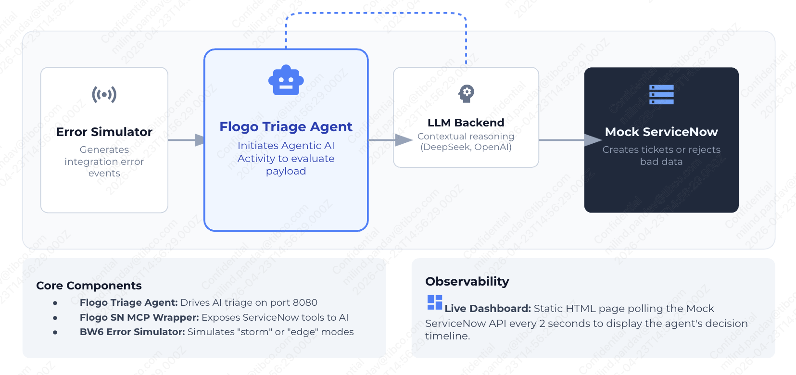
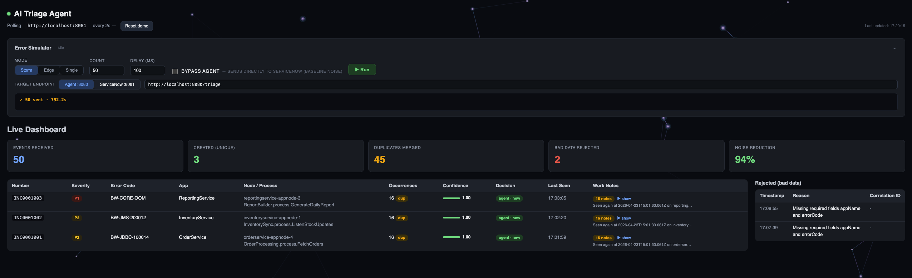

# AI-Powered Incident Triage with TIBCO Flogo® 3 Agentic AI

> **Stop drowning in duplicate tickets.** A TIBCO Flogo® 3 AI Agent watches your integration error stream, reasons about each event, and cuts ServiceNow ticket noise by ~90% — automatically.

---

## 🎯 What This Demo Shows

Enterprises running integration middleware on Kubernetes face a daily problem: every process fault — JDBC timeout, JMS reconnect loop, REST 5xx, out-of-memory — becomes a ServiceNow ticket. On a bad day that's 500+ tickets, ~80% of them duplicates of the same 3–5 root causes.

This demo shows how a **TIBCO Flogo® 3 Agentic AI flow** solves that in real time:

| Without Agent | With Agent |
|---|---|
| 50 events → **50 tickets** | 50 events → **3 tickets** |
| Engineers triage noise all day | Engineers see only unique, actionable incidents |
| Duplicates pile up unlinked | Duplicates merged with occurrence count + audit trail |

---

## 🎬 Demo Scenario

### The Problem
An integration middleware deployment fires 50 error events in 30 seconds — JDBC timeouts, JMS reconnects, REST failures. Without intelligence, each becomes a ServiceNow ticket. The on-call queue explodes.

### The AI-Powered Solution
The same 50 events, now routed through the Flogo AI Agent:

1. **Validate** — malformed events (missing `errorCode`, `appName`) are rejected immediately
2. **Search** — agent queries open incidents from the last 60 minutes via MCP tools
3. **Reason** — the LLM evaluates semantic similarity (not just string matching) and returns a structured decision:
   ```json
   { "decision": "DUPLICATE_OF", "ticketId": "INC0001001", "confidence": 0.92,
     "reason": "Same BW-JDBC-100014 on OrderService, 15 occurrences in last 4 min" }
   ```
4. **Act** — agent calls the right tool: `create_incident`, `append_occurrence`, or `reject_bad_data`
5. **Recommend** — for every new unique incident, the agent searches past resolved tickets for the same error code, synthesises a resolution recommendation (likely cause, remediation steps, estimated effort), and attaches it directly to the ticket — visible in the dashboard drawer the moment the incident is created

### The Edge Cases (What Makes It Interesting)
- **Same error, different app** — `BW-JDBC-100014` on `OrderService` vs `PaymentService` are correctly treated as **two separate incidents**. A rule engine would merge them.
- **Low-confidence guardrail** — when the agent is not sure (confidence < `CONFIDENCE_FLOOR`, default 0.75), it opens a new ticket *and* leaves a "possible duplicate of INCxxxxx" note. SLA protected, human notified.
- **Bad data** — empty payloads and garbage events are rejected cleanly, not silently dropped.

---

## 🏗️ How It Works

```
Integration Error Event
      |
      v
+-------------------------+
|  Flogo Triage Agent     |  POST /triage  (port 8080)
|  (ticket-triage-agent)  |
|                         |
|  1. Validate payload    |
|  2. AgenticAI Activity  |<---> Ollama / OpenAI / Azure OpenAI
|     + MCP Tools         |
|       |                 |      MCP  http://localhost:9090/mcp
|       v                 |
|  +-------------------------+
|  |  Flogo MCP Wrapper      |  (sn-mcp-wrapper, port 9090, path /mcp)
|  |    |- search_incidents          |
|  |    |- create_incident           |<---> Mock ServiceNow (port 8081)
|  |    |- append_occurrence         |
|  |    |- reject_bad_data           |
|  |    |- search_past_resolutions   |
|  |    +- update_incident_resolution|
|  +-------------------------+
|  3. Return decision JSON |
+-------------------------+
```

## Technical Architecture


## 🎬 Demo Video
```
coming soon...
```

### Components

| Component | Location | Role |
|---|---|---|
| **Triage Agent** | `flogo-apps/ticket-triage-agent` | Core AI reasoning flow (Flogo 3 project) |
| **MCP Wrapper** | `flogo-apps/sn-mcp-wrapper` | Exposes ServiceNow as MCP tools (Flogo 3 project) |
| **Mock ServiceNow** | [`../../Ai-Triage-Agent/mock-servicenow/`](../../Ai-Triage-Agent/mock-servicenow/) | Local REST API (incident store) |
| **Error Simulator** | [`../../Ai-Triage-Agent/bw6-error-simulator/`](../../Ai-Triage-Agent/bw6-error-simulator/) | Generates realistic integration error events |
| **Live Dashboard** | [`../../Ai-Triage-Agent/dashboard/index.html`](../../Ai-Triage-Agent/dashboard/) | Real-time view of decisions |

> The two Flogo 3 apps live under this sample's `flogo-apps/` folder — each is a project folder containing an `app.fgmd`. The Node.js helper services (**mock-servicenow**, **bw6-error-simulator**, **dashboard**) were not migrated and remain in the original sample; the relative links above point to them.

---

## 🚀 Running the Demo

### Prerequisites

- **TIBCO Flogo® 3.0.0 or later**, with the **TIBCO Flogo® 3** VS Code extension installed
- **Node.js** v18 or higher (for the mock ServiceNow server, error simulator, and dashboard helpers)
- **Ollama** running locally with `llama3` or `deepseek-v3.1:671b-cloud` pulled
  *(or set an OpenAI / Azure OpenAI base URL + API key via the app properties below for cloud LLMs)*
- **VectorDB custom extension (for `sn-mcp-wrapper` only).** The `flogo-apps/sn-mcp-wrapper` app uses a custom **VectorDB** extension that is **not** part of the standard Flogo contribution set. To build it as a native executable you must supply the VectorDB extension path, e.g.:
  ```bash
  flogo-vscode-cli app build ... -e <path-to-vectordb-extension>
  ```
  `flogo-apps/ticket-triage-agent` builds normally with no extra extension. See **Notes** below.

---

## Setup & Run

1. Open this sample folder in VS Code with the TIBCO Flogo® 3 extension. It detects the Flogo 3 project(s) — each folder containing `app.fgmd`: `flogo-apps/sn-mcp-wrapper` and `flogo-apps/ticket-triage-agent`.
2. Open each app's `.fgprops` file and set the App Properties for your environment (see **App Properties** below).
3. Click the **Flogo 3** icon in the VS Code activity bar → in **RUNTIME EXPLORER**, add a Local Runtime with the **+** button, set any required environment variables, and **Save**.
4. In **FLOGO3: WORKSPACE APPS EXPLORER**, select an app module → right-click → **Run As Executable**. The native binary is produced in that app's `bin/` folder and logs stream to the integrated terminal. (Note: building `sn-mcp-wrapper` requires the VectorDB custom-extension path — see **Prerequisites**.)
5. Run the end-to-end triage demo (**start order matters**):

   **a. Install helper dependencies (once)**
   ```bash
   cd ../../Ai-Triage-Agent/mock-servicenow && npm install && cd -
   cd ../../Ai-Triage-Agent/bw6-error-simulator && npm install && cd -
   ```

   **b. Start the Mock ServiceNow helper (Terminal 1)**
   ```bash
   cd ../../Ai-Triage-Agent/mock-servicenow
   npm start
   # Listening on http://localhost:8081
   ```

   **c. Start the MCP Wrapper app first** — run `flogo-apps/sn-mcp-wrapper` via **Run As Executable** (Step 4), or launch its binary from `flogo-apps/sn-mcp-wrapper/bin/`.
   ```
   # MCP server ready on http://localhost:9090/mcp
   ```

   **d. Then start the Triage Agent app** — run `flogo-apps/ticket-triage-agent` via **Run As Executable** (Step 4), or launch its binary from `flogo-apps/ticket-triage-agent/bin/`.
   ```
   # Triage endpoint ready on http://localhost:8080/triage
   ```

   **e. Open the dashboard**
   ```bash
   open ../../Ai-Triage-Agent/dashboard/index.html
   ```
   The dashboard polls `http://localhost:8081` every 2 seconds and shows live stats and every incident decision.

> **Why this order?** The `ticket-triage-agent` app's MCP client connects to the wrapper at `http://localhost:9090/mcp`, and the wrapper in turn calls Mock ServiceNow at `http://localhost:8081`. Start **Mock ServiceNow → sn-mcp-wrapper (MCP) → ticket-triage-agent**.

---

## ⚙️ App Properties

Set these in each app's `.fgprops` file (App Properties) before running.

### `flogo-apps/ticket-triage-agent`

| Property | Default | What to set |
|---|---|---|
| `AgenticAI.LLMConn.LLM_Provider` | `OpenAI` | LLM provider for the AgenticAI connection (e.g. `OpenAI`) |
| `AgenticAI.LLMConn.API_Key` | *(SECRET)* | Your LLM API key (Ollama Cloud / OpenAI / Azure OpenAI) |
| `AgenticAI.LLMConn.LLM_Base_URL` | `https://ollama.com/v1` | LLM base URL — point at Ollama, OpenAI, or Azure OpenAI |
| `CONFIDENCE_FLOOR` | `0.75` | Confidence threshold; below this the agent opens a new ticket and warns on the possible duplicate |
| `LLM_MODEL` | `deepseek-v3.1:671b-cloud` | Model name to use for reasoning |
| `SN_SEARCH_WINDOW_MIN` | `60` | Minutes to look back when searching open incidents |

### `flogo-apps/sn-mcp-wrapper`

| Property | Default | What to set |
|---|---|---|
| `SN_BASE_URL` | `http://mock-servicenow:8081` | Base URL of the (mock) ServiceNow REST API. For local runs set this to `http://localhost:8081`. |

---

## 📊 Live Dashboard & Simulator
[`../../Ai-Triage-Agent/dashboard/index.html`](../../Ai-Triage-Agent/dashboard/) is a single self-contained file — open it in any browser. It does everything: runs the simulator, streams results live, and displays the full incident table. No extra tooling required once the services are running.



### Error Simulator panel

The top section of the dashboard is a built-in simulator control panel. You never need to open a separate terminal for demo runs.


| Control | What it does |
|---|---|
| **Storm** mode | Blasts N events with heavy duplication — proves noise reduction |
| **Edge** mode | Sends 7 carefully scripted events that cover every decision path |
| **Single** mode | Fires N random individual events |
| **Count / Delay** | Tune volume and pacing |
| **Bypass agent** checkbox | Routes events straight to ServiceNow (baseline noise, no AI) |
| **Target endpoint** presets | Switch between `Agent :8080` and `ServiceNow :8081` in one click |
| **Run / Stop** | Start a run; stop mid-flight if needed |
| **Live log** | Compact progress bar `████░░ 62% · 31/50 sent` with a final summary line |
| **Auto-collapse** | Panel collapses automatically ~1s after a run finishes so the incident table comes into view |

Click the panel header at any time to manually collapse or expand it.

### Incident table


| Column | What it shows |
|---|---|
| **Severity** | P1 – P4 label (resolved from error code if not provided) |
| **Incident / App** | ServiceNow INC number + app name |
| **Error Code** | Integration error code |
| **Occurrences** | How many events were merged into this ticket |
| **Decision** | Colour-coded pill: `agent·new` (green), `agent·low-conf` (amber), `bypass·baseline` (blue) |
| **Confidence** | Number + colour bar: green ≥ 0.85, amber 0.75–0.84, red < 0.75 |
| **Opened** | Relative timestamp |
| **Work notes** | Click any row to expand the agent's full reasoning and audit trail |
| **AI Resolution Recommendation** | Shown in the incident detail drawer for new incidents — likely cause, step-by-step remediation, effort estimate, and whether it's grounded in a past fix |

Stats cards at the top update every 2 seconds: **Events received**, **Created (unique)**, **Duplicates merged**, **Bad data rejected**, **Noise reduction %**.

---

## 🧠 AI Resolution Recommendation

When the agent creates a **new unique incident**, it doesn't stop at filing the ticket. It immediately:

1. **Searches past resolutions** — queries closed/resolved incidents for the same error code to find what actually worked before
2. **Synthesises a recommendation** — the LLM composes a structured suggestion: likely root cause, step-by-step remediation actions, a runbook reference, and estimated effort
3. **Attaches it to the ticket** — the recommendation is persisted on the ServiceNow record and surfaced instantly in the dashboard incident drawer

### Business value

Traditional operations workflows require the on-call engineer to:

- Open the ServiceNow portal and read the ticket
- Search the knowledge base or runbook wiki manually
- Grep Confluence / Slack history for what fixed this last time
- Escalate if they don't know the system

**With AI Resolution Recommendations the first responder opens the incident drawer and immediately sees:**

| What they see | What it replaces |
|---|---|
| Likely root cause in plain English | Digging through stack traces |
| Step-by-step remediation actions to try first | Hunting runbooks and wikis |
| Estimated resolution effort (e.g. "15–30 min") | Gut feel / escalation |
| "Based on past fix" badge when grounded in history | Slack archaeology |
| AI disclaimer — sets correct expectations | Blind trust in automation |

No extra browser tabs. No portal searches. The engineer can start acting in seconds, not minutes.

### Example recommendation (rendered in drawer)

```json
{
  "likely_cause": "JDBC connection pool exhausted — upstream query holding connections open past timeout",
  "recommended_steps": [
    "Check connection pool metrics in the integration middleware admin console",
    "Identify and kill long-running queries in the database",
    "Restart the OrderService integration process agent if pool does not recover",
    "Consider increasing pool size from 10 to 20 as a short-term fix"
  ],
  "runbook_ref": "https://wiki.internal/integration/jdbc-pool-exhaustion",
  "estimated_effort": "15–30 min",
  "based_on_past_fix": true,
  "disclaimer": "AI-generated suggestion. Always validate against current environment state."
}
```

*Visible in the incident detail drawer under **AI Resolution Recommendation** for every new unique incident.*

---

## 🎮 Running the Scenarios

### From the dashboard (recommended for demos)

1. Open [`../../Ai-Triage-Agent/dashboard/index.html`](../../Ai-Triage-Agent/dashboard/)
2. Use the **Error Simulator** panel — no terminal needed
3. Click **Reset demo** in the page header between runs

### Scenario A — The noise problem (baseline)

**Goal:** show the raw ticket flood before the agent.

In the simulator panel:
- Mode: **Storm** · Count: `50` · Delay: `50ms`
- Check **Bypass agent**
- Click **Run**

Watch the dashboard: **50 tickets in ~30 seconds**. This is the customer's daily pain.

</br></br>


Or from the terminal:
```bash
node ../../Ai-Triage-Agent/bw6-error-simulator/simulator.js --mode=storm --count=50 --delayMs=50 --bypass
```

Reset:
```bash
curl -X POST http://localhost:8081/api/now/reset
```

### Scenario B — AI triage in action

**Goal:** same volume, fraction of the tickets.

- Mode: **Storm** · Count: `50` · Delay: `100ms`
- **Uncheck** Bypass agent · Target: `Agent :8080`
- Click **Run**

Expected result:

| Metric | Value |
|---|---|
| Events received | 50 |
| Unique incidents created | ~3 |
| Duplicates merged | ~45 |
| Bad data rejected | 2 |
| **Noise reduction** | **~94%** |


Expand any incident row to read the agent's work notes and confidence score.

### Scenario C — Edge cases

**Goal:** show the cases rule engines get wrong.

- Mode: **Edge** · Count: `7`
- Click **Run**

What to watch:

| Event | Decision | Why it matters |
|---|---|---|
| Event 2 — FraudScreening | **agent·low-conf** (red bar) | Same app + same error code, different downstream service — agent opens new ticket and warns on the original |
| Event 5 — JDBC on PaymentService | **agent·new** | Same error code as OrderService already in store, but different app = separate incident. Rule engines merge these. |
| Event 7 — empty payload | **BAD_DATA** | Rejected cleanly; never touches the incident queue |


---

## 🔧 Troubleshooting

| Symptom | Fix |
|---|---|
| Dashboard shows no data | Run `curl http://localhost:8081/health` — mock ServiceNow must be running |
| Agent returns errors | Check the `ticket-triage-agent` terminal logs; verify Ollama is running with `ollama list` |
| Agent can't reach MCP tools | Confirm `sn-mcp-wrapper` is started **before** `ticket-triage-agent` and is reachable at `http://localhost:9090/mcp` |
| `sn-mcp-wrapper` won't build as executable | Provide the VectorDB custom-extension path to the build (`-e <path-to-vectordb-extension>`) — see **Prerequisites** and **Notes** |
| Port conflict | Change the trigger port in the affected app, or the helper service's `PORT` env var, before starting |
| All confidence scores = 1 | Ollama model may be too small — try `llama3:8b` or `mistral`. We used `deepseek-v3.1:671b-cloud` |

---

## 🗒️ Notes

- **VectorDB extension requirement.** `flogo-apps/sn-mcp-wrapper` depends on a custom **VectorDB** extension that is not shipped with the standard Flogo contribution set. Because of this, the wrapper app will **not** build as a native executable unless you pass the VectorDB extension path to the build command, e.g. `flogo-vscode-cli app build ... -e <path-to-vectordb-extension>`. This is an extra build requirement, not a defect. `flogo-apps/ticket-triage-agent` builds with the standard toolchain.
- **Helper services.** The **mock-servicenow**, **bw6-error-simulator**, and **dashboard** helpers are Node.js/HTML assets that were not migrated to Flogo 3. They remain in the original sample and are referenced above via `../../Ai-Triage-Agent/...` links.

---

## 🔁 Resetting Between Runs

```bash
curl -X POST http://localhost:8081/api/now/reset
```

Or click **Reset demo** in the dashboard header.

---

## 📖 Deep Dive

For a full technical walkthrough — including how the system prompt is structured, why edge cases need pre-seeding, and what the noise-reduction math looks like — read [BLOG.md](../../Ai-Triage-Agent/BLOG.md).
