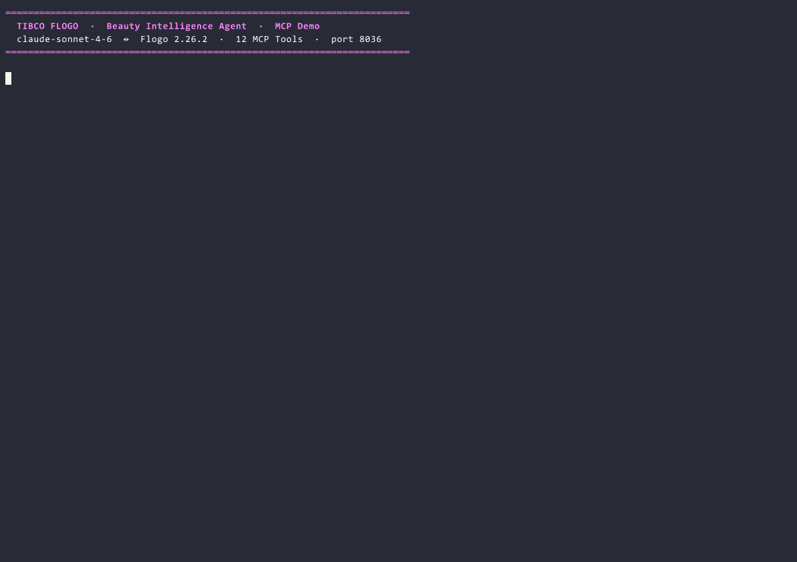

# Beauty Intelligence Agent — Flogo MCP Server Demo

A hyper-personalization engine for retail built on **TIBCO Flogo 2.26.2**. Exposes 12 enterprise tools via the **Model Context Protocol (MCP)**, enabling Claude Desktop to conduct a complete in-store beauty consultation — reading loyalty history, checking inventory, creating targeted offers, and writing back to the database — in under 3 seconds, from a single natural-language prompt.

> **Branding:** All assets use "BeautyCo" / "GlowRewards" as demo placeholders. Swap member names and store IDs in the PostgreSQL seed data only — no code changes required.




---

## Architecture

```
┌─────────────────────────────────────────────────────────────────┐
│  Store Advisor (or automated agent)                             │
│  "Help Asha Patel (M-7724-ASHA) — she's in store 0847"        │
└───────────────────────┬─────────────────────────────────────────┘
                        │  Natural language prompt
                        ▼
┌─────────────────────────────────────────────────────────────────┐
│  Claude Desktop  (claude-sonnet-4-6)                           │
│  Autonomous tool selection — reads profile, history,           │
│  inventory, then writes consultation, offer, and audit         │
└───────────────────────┬─────────────────────────────────────────┘
                        │  MCP over HTTP/SSE · port 8036
                        ▼
┌─────────────────────────────────────────────────────────────────┐
│  TIBCO Flogo 2.26.2  —  beauty-intelligence-agent              │
│                                                                 │
│  READ TOOLS (personalisation phase):                           │
│  ├── GetMemberProfile        → PostgreSQL  members table       │
│  ├── GetPurchaseHistory      → PostgreSQL  transactions table  │
│  ├── GetLoyaltyAccount       → PostgreSQL  loyalty_accounts    │
│  ├── GetBeautyProfile        → PostgreSQL  beauty_profiles     │
│  ├── GetActiveCampaigns      → REST mock   campaigns API       │
│  ├── GetProductInventory     → REST mock   inventory API       │
│  ├── GetStoreContext         → REST mock   store context API   │
│  └── GetRecentReturns        → PostgreSQL  returns table       │
│                                                                 │
│  WRITE TOOLS (action phase):                                   │
│  ├── UpsertConsultationRecord → PostgreSQL consultations table │
│  ├── CreateLoyaltyOffer       → PostgreSQL loyalty_offers      │
│  ├── TriggerMarketingSequence → REST mock  marketing API       │
│  └── LogAgentDecision         → PostgreSQL audit_log           │
└───────────────────────┬─────────────────────────────────────────┘
                        │
              ┌─────────┴──────────┐
              ▼                    ▼
┌─────────────────────┐  ┌────────────────────────────────────┐
│  PostgreSQL 16      │  │  beauty-mock-apis (Flogo)          │
│  beauty_db          │  │  port 9091                         │
│  ├─ members         │  │  ├─ GET /campaigns/:memberId        │
│  ├─ transactions    │  │  ├─ GET /inventory/:sku/:storeId    │
│  ├─ loyalty_accts   │  │  ├─ GET /store/:storeId            │
│  ├─ beauty_profiles │  │  └─ POST /marketing/trigger        │
│  ├─ returns         │  └────────────────────────────────────┘
│  ├─ consultations   │
│  ├─ loyalty_offers  │  ┌────────────────────────────────────┐
│  └─ audit_log       │  │  Dashboard                         │
└─────────────────────┘  │  dashboard/index.html              │
                         │  Real-time audit log viewer        │
                         └────────────────────────────────────┘
```

---

## The 12 MCP Tools

### Read Tools — Personalisation Phase

| # | Tool | Connector | What Claude Gets |
|---|---|---|---|
| 1 | `GetMemberProfile` | PostgreSQL | Name, tier (Member/Platinum/Diamond), join date, preferred store, birth month, KYC |
| 2 | `GetPurchaseHistory` | PostgreSQL | Last 20 transactions: SKU, brand, category, price, channel, date |
| 3 | `GetLoyaltyAccount` | PostgreSQL | Points balance, tier progress, next expiry, redemption history |
| 4 | `GetBeautyProfile` | PostgreSQL | Skin tone, skin concerns, hair texture, allergy flags — safety-critical |
| 5 | `GetActiveCampaigns` | REST mock | Active promos for this tier: campaign_id, offer_type, discount, eligible_brands |
| 6 | `GetProductInventory` | REST mock | In-stock quantity, online availability, low-stock flag, GWP promos |
| 7 | `GetStoreContext` | REST mock | Store hours, upcoming events, advisor availability, store-level promotions |
| 8 | `GetRecentReturns` | PostgreSQL | Last 6 months of returns: SKU, brand, reason, resolution |

**Safety note:** `GetBeautyProfile` must be called before any product recommendation. Allergy flags are hard constraints — Claude is instructed to never recommend a flagged ingredient.

### Write Tools — Action Phase

| # | Tool | Connector | What It Does |
|---|---|---|---|
| 9 | `UpsertConsultationRecord` | PostgreSQL | Writes consultation: recommended SKUs, offer applied, channel, advisor notes |
| 10 | `CreateLoyaltyOffer` | PostgreSQL | Generates targeted offer: BONUS_POINTS / BIRTHDAY / TIER_CHALLENGE / PRODUCT_DISCOUNT |
| 11 | `TriggerMarketingSequence` | REST mock | Queues post-visit email or push: RESTOCK_REMINDER / NEW_LAUNCH / REPLENISHMENT |
| 12 | `LogAgentDecision` | PostgreSQL | Compliance audit: full reasoning text, tools used, outcome, confidence score |

---

## Demo Scenarios

Three pre-seeded members illustrate different use cases:

| Member ID | Name | Tier | Demo Hook | Wow Moment |
|---|---|---|---|---|
| `M-7724-ASHA` | Asha Patel | Diamond | 4,200 points, skincare loyalist | Claude identifies she's near a Platinum renewal and creates a tier-challenge bonus offer unprompted |
| `M-1138-CASS` | Cassandra Williams | Platinum | Birthday month = this month | Claude detects birth month from `GetMemberProfile` and triggers a birthday loyalty offer automatically |
| `M-0042-JUNE` | June Chen | Member | Paraben allergy flagged | Claude reads `GetBeautyProfile`, sees the paraben flag, and explicitly excludes all paraben-containing SKUs from recommendations |

---

## Project Structure

```
beauty-intelligence-agent/
├── README.md
├── beauty-intelligence-agent.flogo   Main MCP server (12 tools, port 8036)
├── beauty-mock-apis.flogo            Mock REST APIs (campaigns/inventory/store, port 9091)
├── retailco-demo.gif                 Animated demo GIF
├── database/
│   ├── beauty-schema.sql             PostgreSQL DDL — core tables
│   ├── beauty-schema-patch-001.sql   Schema patch 1
│   └── beauty-schema-patch-002.sql   Schema patch 2
├── presentation/
│   ├── index.html                    10-slide self-contained HTML deck (offline)
│   ├── flow-infographic.html         Flow diagram visualization
│   ├── screenshots/                  Architecture screenshots
│   └── notebooklm/                   Exported PDF + PPTX slide deck
├── dashboard/
│   ├── index.html                    Real-time audit log viewer
│   ├── dashboard_server.py           Python WebSocket server
│   └── requirements.txt              Python dependencies
├── scripts/
│   ├── demo-live.ps1                 Interactive PowerShell presenter
│   ├── demo-trigger.ps1              Demo trigger script
│   └── record_demo.py               Python MCP cast recorder
├── video/
│   └── src/                          Remotion TypeScript video source
└── Test/
    ├── run_tests.py                  Test runner
    └── scenario-*.json               Test scenario data
```

---

## Prerequisites

| Tool | Version | Purpose |
|---|---|---|
| Docker Desktop | ≥ 24.x | Run PostgreSQL 16-alpine |
| TIBCO Flogo CLI | 2.26.2 | Build and run Flogo apps |
| PostgreSQL client | ≥ 14 | Seed the database schema |
| Claude Desktop | Latest | MCP client — connects to port 8036 |
| Python | ≥ 3.9 | Dashboard server and test runner |

---

## Quick Start

### 1. Start PostgreSQL

A `docker-compose.yml` is in the `demo_retail/` parent folder:

```bash
cd demo_retail
docker compose up -d
```

Verify: `docker compose ps` — `retailco-postgres` should be `healthy`.

### 2. Seed the database

```bash
# Create database and apply schema
psql -h localhost -U postgres -c "CREATE DATABASE beauty_db;"
psql -h localhost -U postgres -d beauty_db -f beauty-intelligence-agent/database/beauty-schema.sql
psql -h localhost -U postgres -d beauty_db -f beauty-intelligence-agent/database/beauty-schema-patch-001.sql
psql -h localhost -U postgres -d beauty_db -f beauty-intelligence-agent/database/beauty-schema-patch-002.sql
```

Verify:
```bash
psql -h localhost -U postgres -d beauty_db \
  -c "SELECT member_id, full_name, loyalty_tier FROM members;"
```

Expected: Three rows — Asha Patel (DIAMOND), Cassandra Williams (PLATINUM), June Chen (MEMBER).

### 3. Build and start the mock APIs

```bash
cd demo_retail/beauty-intelligence-agent
flogo build -f beauty-mock-apis.flogo -o beauty-mock-apis
./beauty-mock-apis &
```

Verify:
```bash
curl "http://localhost:9091/campaigns/M-7724-ASHA"
# Returns active campaign list for Asha
```

### 4. Build and start the MCP server

```bash
flogo build -f beauty-intelligence-agent.flogo -o beauty-intelligence-agent
./beauty-intelligence-agent
```

Verify:
```
[INFO] MCP Server listening on :8036/mcp
```

### 5. Connect Claude Desktop

Add to your Claude Desktop MCP configuration (`claude_desktop_config.json`):

```json
{
  "mcpServers": {
    "beauty-agent": {
      "url": "http://localhost:8036/mcp"
    }
  }
}
```

Restart Claude Desktop. You should see 12 tools available.

### 6. Start the dashboard (optional)

```bash
cd demo_retail/beauty-intelligence-agent/dashboard
pip install -r requirements.txt
python dashboard_server.py
# Open dashboard/index.html in your browser
```

The dashboard shows a real-time stream of `LogAgentDecision` entries — every tool call Claude makes, the confidence score, and the final recommendation. Compelling to show on a second screen during live demos.

### 7. Run the demo

In Claude Desktop, try any of these prompts:

**Scenario 1 — VIP Diamond member:**
> *"A Diamond member has just walked into store 0847. Member ID is M-7724-ASHA. Please generate a personalized consultation."*

**Scenario 2 — Birthday WOW:**
> *"I have member M-1138-CASS in front of me at the counter. Can you check her profile and see if there's anything special we should do for her today?"*

**Scenario 3 — Allergy safety check:**
> *"New member M-0042-JUNE is interested in our skincare range. Please do a full profile check before making any recommendations."*

---

## App Properties Reference

| Property | Default | Description |
|---|---|---|
| `PostgreSQL.beauty-pg-conn-001.Host` | `localhost` | PostgreSQL host |
| `PostgreSQL.beauty-pg-conn-001.Port` | `5432` | PostgreSQL port |
| `PostgreSQL.beauty-pg-conn-001.Database_Name` | `beauty_db` | Database name |
| `PostgreSQL.beauty-pg-conn-001.User` | `postgres` | DB user |
| `PostgreSQL.beauty-pg-conn-001.Password` | `SECRET:...` | Encrypted — change before prod |
| `MockAPI.BaseUrl` | `http://localhost:9091` | Mock API server base URL |

---

## Running the Tests

```bash
cd demo_retail/beauty-intelligence-agent/Test
python run_tests.py
```

The test runner calls each MCP tool with the scenario JSON data and validates the response structure. All three scenarios must pass before a demo is considered production-ready.

---

## The Business Value Proposition

| Metric | Value |
|---|---|
| End-to-end consultation time | **< 3 seconds** |
| Enterprise tools called | **Up to 12** per consultation |
| Lines of custom integration code | **0** |
| Data leaves the network | **No** — all queries on-prem |
| Audit trail | **100%** — every tool call logged |
| Hallucination risk | **Minimal** — Claude reads real DB data, not model memory |

**The close:** *"Every retailer has the data. Flogo makes that data AI-callable in hours, not months — with zero custom code, full audit trail, and no data leaving your network."*

---

## Troubleshooting

| Symptom | Cause | Fix |
|---|---|---|
| `tools/call` returns null | `action.input` not wired | Check handler `arguments.mapping` in `.flogo` |
| PostgreSQL connection refused | Docker not started | `docker compose up -d` in `demo_retail/` |
| Allergy flag not respected | `GetBeautyProfile` not called | Ensure Claude's system prompt instructs it to call profile first |
| Port 8036 already in use | Previous instance running | Kill previous process |
| Dashboard shows no events | `dashboard_server.py` not running | `python dashboard_server.py` in `dashboard/` |
| Schema patch error | Applying patches out of order | Apply `beauty-schema.sql` first, then patch-001, then patch-002 |
