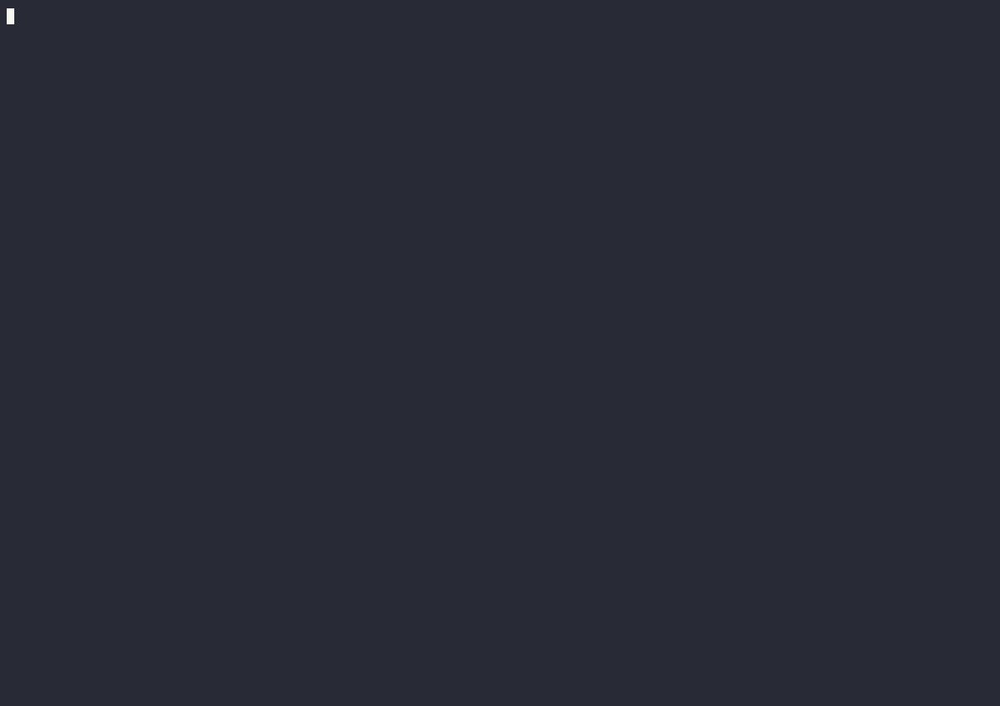

# Morning Briefing — Flogo Workflow

A TIBCO Flogo 2.26.2 implementation of the morning briefing concept described in
[*I built a morning briefing that reads my Slack, email, calendar and reminders*](https://www.stigterhq.nl/2026/05/i-built-a-morning-briefing-that-reads-my-slack-email-calendar-and-reminders/).

The workflow aggregates data from four sources, sends it to Claude AI, and returns a
prioritized markdown report in three tiers: 🔴 Needs Attention · 🟡 Important Today · 🟢 Awareness.



---

## Architecture

```
  ┌──────────────────────────────────────────────────────────────────────┐
  │                    morning-briefing Flogo App                        │
  │                                                                      │
  │  REST Trigger          Timer Trigger                                 │
  │  GET /api/morning-     Cron: 0 7 * * *                              │
  │  briefing              (7 AM daily)                                  │
  │       │                      │                                       │
  │       └──────────┬───────────┘                                       │
  │                  ▼                                                    │
  │           MorningBriefingMain Flow                                   │
  │                  │                                                    │
  │    ┌─────────────▼──────────────────────────┐                       │
  │    │           PHASE 1: GATHER               │                       │
  │    │                                         │                       │
  │    │  GetSlackMessages  ──► REST GET ────────┼──► Wiremock :8523    │
  │    │  GetEmails         ──► REST GET ────────┼──► MailHog  :8025    │
  │    │  GetCalendarEvents ──► REST GET ────────┼──► Wiremock :8523    │
  │    │  GetReminders      ──► REST GET ────────┼──► Wiremock :8523    │
  │    └─────────────────────────────────────────┘                       │
  │                  │                                                    │
  │    ┌─────────────▼──────────────────────────┐                       │
  │    │       PHASE 2: PRIORITIZE               │                       │
  │    │                                         │                       │
  │    │  BuildBriefingPrompt (JsExec)           │                       │
  │    │   → assemble user prompt from 4 sources │                       │
  │    │                                         │                       │
  │    │  CallClaudeAI (AI Agent Preview) ───────┼──► Anthropic API     │
  │    │   → system prompt + user prompt         │                       │
  │    │   → returns formatted briefing text     │                       │
  │    └─────────────────────────────────────────┘                       │
  │                  │                                                    │
  │    ┌─────────────▼──────────────────────────┐                       │
  │    │         PHASE 3: OUTPUT                 │                       │
  │    │                                         │                       │
  │    │  LogBriefing  ──► engine log            │                       │
  │    │  ReturnBriefing ──► HTTP 200 response   │                       │
  │    └─────────────────────────────────────────┘                       │
  └──────────────────────────────────────────────────────────────────────┘
```

---

## Project Structure

```
morning-briefing/
├── README.md
├── morning-briefing.flogo           Flogo application definition
├── morning-briefing.gif             Animated demo GIF
├── infrastructure/
│   ├── docker-compose.yml           Wiremock + MailHog containers
│   └── wiremock/
│       └── mappings/
│           ├── slack-messages.json  Mock Slack API response
│           ├── calendar-events.json Mock Calendar API response
│           └── reminders.json       Mock Reminders API response
├── presentation/
│   └── Automated_AI_Morning_Briefing_Workflow.png  Architecture diagram
└── scripts/
    ├── trigger-demo.py              Python demo trigger + pretty-print
    └── record-demo.ps1              ffmpeg screen recorder
```

---

## Prerequisites

| Tool            | Version    | Purpose                                |
|-----------------|------------|----------------------------------------|
| Docker Desktop  | ≥ 24.x     | Run Wiremock + MailHog containers      |
| TIBCO Flogo CLI | 2.26.2     | Build and run the Flogo app            |
| Anthropic API   | —          | Claude AI for briefing generation      |

---

## Quick Start

### 1. Start the demo external services

```bash
cd morning-briefing/infrastructure
docker compose up -d
```

Wait ~10 seconds, then verify:

```bash
# Wiremock (mock Slack, Calendar, Reminders)
curl http://localhost:8523/slack/messages

# MailHog HTTP API (email)
curl http://localhost:8025/api/v2/messages

# MailHog web UI
open http://localhost:8025
```

To populate demo emails in MailHog:
```bash
# Send a test email via SMTP
curl --url "smtp://localhost:1025" \
  --mail-from "alice@demo.com" \
  --mail-rcpt "you@demo.com" \
  --upload-file - <<EOF
From: alice@demo.com
To: you@demo.com
Subject: Q2 Budget Review — needs your sign-off

Hi, the Q2 budget spreadsheet is ready for your review and approval. Please respond by EOD today.
EOF
```

### 2. Set your OpenAI API key

Edit `morning-briefing.flogo` and replace the `OpenAI.ApiKey` property value:

```json
{
  "name": "OpenAI.ApiKey",
  "type": "string",
  "value": "sk-YOUR-REAL-OPENAI-KEY-HERE"
}
```

### 3. Build and run the Flogo app

```bash
# Using Flogo CLI
flogo build
./morning-briefing
```

The app listens on port **9095** (configurable via `App.Port` property).

### 4. Trigger a briefing

```bash
curl http://localhost:9095/api/morning-briefing
```

The response is a JSON object with a `briefing` field containing the formatted markdown.

For a prettier display:
```bash
curl -s http://localhost:9095/api/morning-briefing | jq -r '.briefing'
```

---

## App Properties Reference

All configurable values live in the `properties` section of `morning-briefing.flogo`.

| Property           | Default Value                                       | Description                           |
|--------------------|-----------------------------------------------------|---------------------------------------|
| `App.Port`         | `9095`                                              | Flogo REST server port                |
| `Slack.ApiUrl`     | `http://localhost:8523/slack/messages`              | Wiremock mock endpoint                |
| `Email.MailHogUrl` | `http://localhost:8025/api/v2/messages`             | MailHog API endpoint                  |
| `Calendar.ApiUrl`  | `http://localhost:8523/calendar/events`             | Wiremock mock endpoint                |
| `Reminders.ApiUrl` | `http://localhost:8523/reminders`                   | Wiremock mock endpoint                |
| `OpenAI.ApiUrl`    | `https://api.openai.com/v1/chat/completions`        | OpenAI Chat Completions endpoint      |
| `OpenAI.ApiKey`    | `sk-REPLACE-WITH-YOUR-OPENAI-KEY`                   | **Replace this with your real key**   |
| `OpenAI.Model`     | `gpt-4o`                                            | OpenAI model to use                   |
| `OpenAI.MaxTokens` | `2048`                                              | Max tokens for the briefing response  |

---

## Flow Details

### MorningBriefingMain

| Step | Activity              | Type          | Description                                              |
|------|-----------------------|---------------|----------------------------------------------------------|
| 1    | `StartActivity`       | noop          | Flow entry point                                         |
| 2    | `GetSlackMessages`    | rest          | GET mock Slack messages (Wiremock)                       |
| 3    | `GetEmails`           | rest          | GET unread emails (MailHog)                              |
| 4    | `GetCalendarEvents`   | rest          | GET today's calendar (Wiremock)                          |
| 5    | `GetReminders`        | rest          | GET today's tasks/reminders (Wiremock)                   |
| 6    | `BuildBriefingPrompt` | jsexec        | Assemble user prompt text from all four data sources     |
| 7    | `CallClaudeAI`        | agentactivity | Call Claude via AI Agent Preview with system + user prompt |
| 8    | `LogBriefing`         | log           | Print briefing to engine log                             |
| 9    | `ReturnBriefing`      | actreturn     | Return `{ briefing: "..." }` with HTTP 200               |

### Triggers

| Trigger ID                      | Type  | Config                          |
|---------------------------------|-------|---------------------------------|
| `MorningBriefingRESTTrigger`    | REST  | GET /api/morning-briefing :9095 |
| `MorningBriefingTimerTrigger`   | Timer | Cron: `0 7 * * *` (7 AM daily) |

---

## Briefing Output Format

The AI produces a markdown report with these sections (empty sections are omitted):

```markdown
## 🔴 Needs Attention
- **@alice** is blocked waiting for PR #342 review — EOD deadline
- ⚠️ Expense report is 2 days overdue

## 🟡 Important Today
- Architecture Review at 11:00 — prep by reading API design doc in #platform
- 1:1 at 14:00 — update manager on Q2 OKR progress
- Q2 budget email from Alice needs sign-off reply

## Today's Schedule
| Time  | Meeting                     | Type      |
|-------|-----------------------------|-----------|
| 09:30 | Daily Standup               | Recurring |
| 11:00 | Architecture Review         | Meeting   |
| 14:00 | 1:1 with Manager            | 1:1       |

## Today's Tasks
- [ ] Review OKRs with team
- [ ] Send v2.3 release notes to stakeholders
- [ ] Call dentist
- [x] ⚠️ Submit Q2 expense report (OVERDUE 2 days)

## Unread Emails
- **Alice — Q2 Budget Review**: needs sign-off by EOD (needs-reply)

## Slack Activity
- **DM from Carol**: wants 5 min before architecture review — reply or decline
- **#releases**: v2.3 ready to ship tomorrow (FYI)

## 🟢 Awareness
- Platform maintenance tonight 22:00–23:00 UTC — no action needed
- Dave asked for Q2 metrics spreadsheet — low priority
```

---

## Connecting Real Data Sources

To replace demo mocks with live integrations, update the corresponding app property and
swap the mock URL for the real API endpoint:

| Source           | Real API                                              | Auth required          |
|------------------|-------------------------------------------------------|------------------------|
| Slack            | `https://slack.com/api/conversations.history`         | Bot OAuth token        |
| Outlook Email    | `https://graph.microsoft.com/v1.0/me/mailFolders/inbox/messages?$filter=isRead eq false` | Azure AD OAuth2 |
| Google Calendar  | `https://www.googleapis.com/calendar/v3/calendars/primary/events` | Google OAuth2 |
| Reminders        | `https://api.todoist.com/rest/v2/tasks?filter=today`  | Todoist API token      |

For authenticated APIs, add the required `Authorization` or `Bearer` headers to the
corresponding REST activity's `dynamicRequestHeaders` section in the `.flogo` file.

---

## Troubleshooting

**Wiremock returns 404 for `/slack/messages`**
→ Check that `./wiremock/mappings/*.json` files are mounted correctly.
→ Run `docker compose logs wiremock` to see stub loading output.

**OpenAI returns 401 Unauthorized**
→ The `OpenAI.ApiKey` property is still set to the placeholder value.
→ Replace it with your real OpenAI API key.

**OpenAI returns 400 Bad Request**
→ The `BuildBriefingPrompt` JsExec may have produced invalid JSON.
→ Check the Flogo engine log for the raw request body.

**Port 9095 already in use**
→ Change `App.Port` property value in the `.flogo` file to any free port.

**Port 8523 already in use**
→ Update `docker-compose.yml` to use a different host port and update all three Wiremock property values accordingly.
