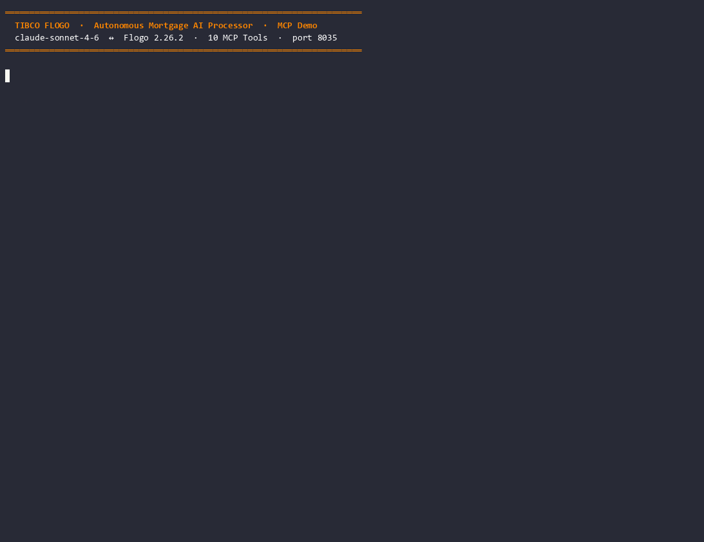

# Mortgage AI Processor — Flogo MCP Server Demo

An autonomous mortgage assessment system built on **TIBCO Flogo 2.26.2**. Exposes 10 enterprise tools via the **Model Context Protocol (MCP)**, enabling Claude Desktop (or any MCP-compatible AI agent) to conduct a complete loan assessment — pulling credit scores, verifying employment, calculating DTI, and issuing a binding decision — in under 3 seconds, without the mortgage officer touching a single internal system.




---

## Architecture

```
┌─────────────────────────────────────────────────────────────────┐
│  Mortgage Officer (or automated agent)                          │
│  "Assess application APP-2026-4821 for Sarah Chen"             │
└───────────────────────┬─────────────────────────────────────────┘
                        │  Natural language prompt
                        ▼
┌─────────────────────────────────────────────────────────────────┐
│  Claude Desktop  (claude-sonnet-4-6)                           │
│  Autonomous tool selection + sequencing                         │
└───────────────────────┬─────────────────────────────────────────┘
                        │  MCP over HTTP/SSE · port 8035
                        ▼
┌─────────────────────────────────────────────────────────────────┐
│  TIBCO Flogo 2.26.2  —  mortgage-mcp-server                    │
│                                                                 │
│  READ TOOLS (investigation phase):                             │
│  ├── GetApplicantProfile   → PostgreSQL  mortgage_db           │
│  ├── GetCreditScore        → REST        credit bureau API     │
│  ├── GetPropertyValuation  → REST        property valuation    │
│  ├── CheckExistingDebts    → PostgreSQL  existing_debts table  │
│  ├── VerifyEmployment      → REST        employment API        │
│  └── CalculateDTI          → JsExec      (in-process logic)    │
│                                                                 │
│  WRITE TOOLS (decision phase):                                 │
│  ├── ApproveMortgage       → PostgreSQL  mortgage_decisions    │
│  ├── EscalateToUnderwriter → PostgreSQL  + EMS queue          │
│  ├── DeclineMortgage       → PostgreSQL  mortgage_decisions    │
│  └── LogDecision           → PostgreSQL  audit_log            │
└───────────────────────┬─────────────────────────────────────────┘
                        │
              ┌─────────┴──────────┐
              ▼                    ▼
┌─────────────────────┐  ┌─────────────────────────────┐
│  PostgreSQL 16      │  │  mortgage-mock-apis (Flogo)  │
│  mortgage_db        │  │  port 9091                   │
│  ├─ applicants      │  │  ├─ GET /credit/:id          │
│  ├─ existing_debts  │  │  ├─ POST /property/valuation │
│  ├─ mortgage_       │  │  └─ GET /employment/:id      │
│  │   decisions      │  └─────────────────────────────┘
│  └─ audit_log       │
└─────────────────────┘
```

---

## The 10 MCP Tools

### Read Tools — Investigation Phase

| Tool | Connector | What Claude Gets |
|---|---|---|
| `GetApplicantProfile` | PostgreSQL `applicants` table | Full name, DOB, address, KYC status, risk band |
| `GetCreditScore` | REST → credit bureau API | Score (300–850), defaults count, payment history %, utilization % |
| `GetPropertyValuation` | REST → property valuation API | Estimated value, LTV ratio, confidence score |
| `CheckExistingDebts` | PostgreSQL `existing_debts` table | All active debts, lender names, monthly obligations |
| `VerifyEmployment` | REST → employment verification API | Employment status, annual income, tenure (months) |
| `CalculateDTI` | JsExec (in-process) | DTI ratio (%), affordability flag (PASS/FAIL/BORDERLINE) |

### Write Tools — Decision Phase

| Tool | Connector | What It Does |
|---|---|---|
| `ApproveMortgage` | PostgreSQL `mortgage_decisions` | Records approval: loan amount, interest rate, LTV, DTI |
| `EscalateToUnderwriter` | PostgreSQL + EMS | Writes escalation record + publishes to `UNDERWRITING.QUEUE` |
| `DeclineMortgage` | PostgreSQL `mortgage_decisions` | Records decline with reason code and AI reasoning |
| `LogDecision` | PostgreSQL `audit_log` | Regulatory audit record: tools used, AI reasoning, confidence |

**Note:** Claude autonomously selects which read tools to call and in what order. The write tools are mutually exclusive — exactly one of Approve, Escalate, or Decline is called per assessment. `LogDecision` is always called last.

---

## Demo Scenarios

Three pre-seeded applicants drive the three decision outcomes:

| Application ID | Applicant | Outcome | Key Signal |
|---|---|---|---|
| `APP-2026-4821` | Sarah Chen | **APPROVED** | Credit 742, DTI 28%, employed 4 yrs |
| `APP-2026-5503` | Marcus Williams | **ESCALATED** | Credit 681, self-employed 14 months, borderline DTI |
| `APP-2026-6107` | Elena Kowalski | **DECLINED** | Credit 598, 3 defaults, DTI 58% |

---

## Project Structure

```
mortgagedemo/
├── README.md
├── mortgage-mcp-server.flogo        Main MCP server (10 tools, port 8035)
├── mortgage-mock-apis.flogo         Mock REST backend (credit/employment/valuation, port 9091)
├── mortgage-mcp-demo.gif            Animated demo GIF
├── database/
│   └── mortgage-schema.sql          PostgreSQL DDL + seed data for all 3 scenarios
├── presentation/
│   └── mortgage-ai-processor-demo.html  Standalone HTML slide deck (offline)
└── scripts/
    ├── demo-mortgage-mcp.ps1        Interactive PowerShell presenter (step-by-step cue cards)
    └── record_demo.py               Python MCP cast recorder (stdlib only)
```

---

## Prerequisites

| Tool | Version | Purpose |
|---|---|---|
| Docker Desktop | ≥ 24.x | Run PostgreSQL 16-alpine |
| TIBCO Flogo CLI | 2.26.2 | Build and run Flogo apps |
| PostgreSQL client | ≥ 14 | Seed the database |
| Claude Desktop | Latest | MCP client — connects to port 8035 |
| Python | ≥ 3.9 | `record_demo.py` — no pip packages required |
| ffmpeg | Any | Screen recording (optional) |

---

## Quick Start

### 1. Start PostgreSQL

```bash
cd mortgagedemo
docker compose up -d
```

Verify: `docker compose ps` — `mortgage-postgres` should be `healthy`.

### 2. Seed the database

```bash
psql -h localhost -U postgres -c "CREATE DATABASE mortgage_db;"
psql -h localhost -U postgres -d mortgage_db -f database/mortgage-schema.sql
```

Verify:
```bash
psql -h localhost -U postgres -d mortgage_db -c "SELECT application_id, applicant_name FROM applicants;"
```

Expected output: three rows (Sarah Chen, Marcus Williams, Elena Kowalski).

### 3. Build and start the mock APIs

```bash
flogo build -f mortgage-mock-apis.flogo -o mortgage-mock-apis
./mortgage-mock-apis &
```

Verify:
```bash
curl http://localhost:9091/credit/APP-2026-4821
# {"applicationId":"APP-2026-4821","creditScore":742,...}
```

### 4. Build and start the MCP server

```bash
flogo build -f mortgage-mcp-server.flogo -o mortgage-mcp-server
./mortgage-mcp-server
```

Verify the server is ready:
```
[INFO] MCP Server listening on :8035/mcp
```

### 5. Connect Claude Desktop

Add this entry to your Claude Desktop MCP configuration (`claude_desktop_config.json`):

```json
{
  "mcpServers": {
    "mortgage-processor": {
      "url": "http://localhost:8035/mcp"
    }
  }
}
```

Restart Claude Desktop. The 10 mortgage tools should appear in the tools list.

### 6. Run a demo assessment

In Claude Desktop, type:

> *"Please assess mortgage application APP-2026-4821 for Sarah Chen and provide a recommendation."*

Claude will autonomously call the Flogo tools, analyze the results, and return a structured decision.

---

## App Properties Reference

All configuration lives in the `properties` section of `mortgage-mcp-server.flogo` — no hardcoded values.

| Property | Default | Description |
|---|---|---|
| `MCPServer.Port` | `8035` | MCP server port |
| `PostgreSQL.MortgageDBConnection.Host` | `localhost` | PostgreSQL host |
| `PostgreSQL.MortgageDBConnection.Port` | `5432` | PostgreSQL port |
| `PostgreSQL.MortgageDBConnection.Database_Name` | `mortgage_db` | Database name |
| `PostgreSQL.MortgageDBConnection.User` | `postgres` | DB user |
| `PostgreSQL.MortgageDBConnection.Password` | `SECRET:...` | Encrypted — change before prod |
| `PostgreSQL.MortgageDBConnection.Maximum_Open_Connections` | `10` | Connection pool size |
| `PostgreSQL.MortgageDBConnection.Maximum_Connection_Lifetime` | `0s` | Must be string `"0s"` |

---

## Recording the Demo

### Animated GIF (terminal demo)

```bash
# Start all services (PostgreSQL, mock-apis, mcp-server) first
python record_demo.py
# → writes mortgage-demo.cast

agg mortgage-demo.cast mortgage-mcp-demo.gif --font-size 14 --theme dracula
```

### Screen recording (MP4)

```powershell
.\demo-mortgage-mcp.ps1   # interactive step-by-step presenter
# OR for ffmpeg screen capture:
# run demo-mortgage-mcp.ps1 in one window, record with ffmpeg in another
```

---

## Database Schema Summary

```sql
-- Core tables seeded by mortgage-schema.sql
applicants          -- personal details, KYC status, risk band
existing_debts      -- all active debts per applicant
mortgage_decisions  -- written by Approve / Decline tools
audit_log           -- written by LogDecision (regulatory compliance)
```

The schema file includes realistic seed data for all three demo applicants. No real PII is used.

---

## How the MCP Protocol Works

```
Claude Desktop
   POST /mcp  {"jsonrpc":"2.0","method":"initialize",...}
   POST /mcp  {"method":"notifications/initialized"}
   POST /mcp  {"method":"tools/list"}           ← gets 10 tools
   POST /mcp  {"method":"tools/call","params":{"name":"GetApplicantProfile",...}}
   POST /mcp  {"method":"tools/call","params":{"name":"GetCreditScore",...}}
   ...        (Claude chooses tool order autonomously)
   POST /mcp  {"method":"tools/call","params":{"name":"ApproveMortgage",...}}
   POST /mcp  {"method":"tools/call","params":{"name":"LogDecision",...}}
```

Each `tools/call` request is handled by a dedicated Flogo flow. The flow reads from its PostgreSQL table or calls the mock REST API, then returns a JSON result to Claude via the MCP response. Claude's next tool call may depend on the previous result — autonomous chaining with no hardcoded sequence.

---

## Troubleshooting

| Symptom | Cause | Fix |
|---|---|---|
| `tools/call` returns null | `action.input` not wired | Check handler `arguments.mapping` in `.flogo` |
| PostgreSQL connection refused | Docker not started | `docker compose up -d` |
| Port 8035 already in use | Previous instance running | Kill previous process |
| `string.concat not found` | Missing import | Add `github.com/project-flogo/contrib/function/string` |
| `Maximum_Connection_Lifetime` error | Value is integer, not string | Set to `"0s"` (string) in properties |
| EMS escalation fails | EMS not configured | `EscalateToUnderwriter` falls back to PostgreSQL-only write |
